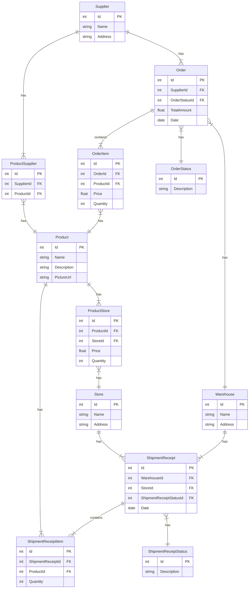

# DeliArg
This solution will allow DeliArg to manage the stock of its products in various warehouses and stores, including supplier orders.

## **About the solution**
The backend is in a single project, to keep the configurations simple and focus on the use of Blazor as a frontend technology.
When developing the solution I took into account the following concepts:

- SOLID principles
   - Single responsibility principle
   - Open/closed principle
   - Liskov substitution principle
   - Interface segregation principle
   - Dependency inversion principle
- DRY (Don't Repeat Yourself)
- YAGNI (You Aren't Gonna Need It)

I also used the following methodologies:

- C# Coding conventions (https://docs.microsoft.com/en-us/dotnet/csharp/fundamentals/coding-style/coding-conventions)
- Conventional commits (https://www.conventionalcommits.org/en/v1.0.0/)

## **Tools**

Development tools, frameworks and libraries used:

- Visual Studio 2022
- .NET 7 (WebApi and Blazor)
- Swagger
- AutoMapper
- Entity Framework Core
- Postman

## **Analysis and development process**

The user stories that I developed, in addition to the CRUD of the entities, are:

- ~~As a store manager, I want to order products from warehouses.~~
- ~~As a warehouse manager, I want to order products to suppliers.~~

### **Entity relationship diagram**

